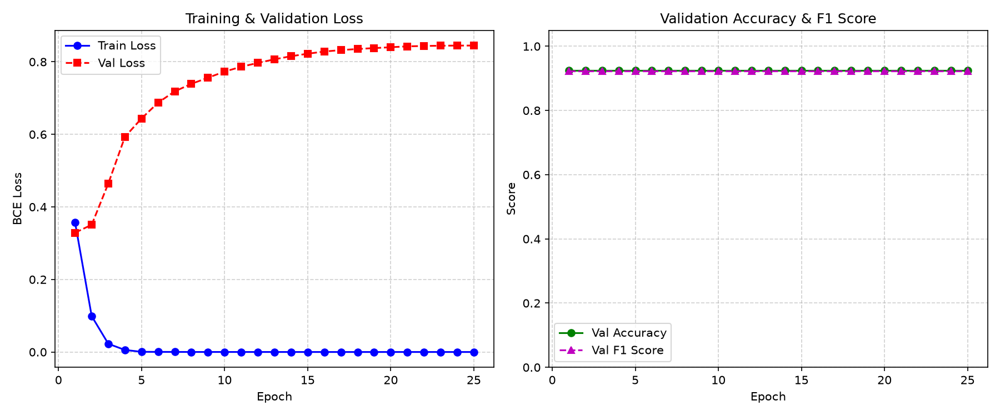

# AI Video Violence Detection System 🛡️🥊

An end-to-end Deep Learning system for real-time and recorded video violence detection. Powered by a spatial-temporal neural network architecture (**MobileNetV2 + Bidirectional LSTM with Attention**) trained and evaluated on the benchmark **Hockey Fight Dataset**, achieving **92.5% Validation Accuracy** and **0.923 F1 Score**.

---

## 🚀 Features

- 📹 **Dual Detection Modes**:
  - **Live Webcam Monitoring**: Stream analysis with real-time HUD, exponential moving average (EMA) smoothing, and red/green visual alerts.
  - **Recorded Video File Analysis**: Fast video processing with timestamp tracking, progress indicator, and comprehensive incident summary report.
- 🧠 **Deep Learning Architecture**:
  - Spatial feature extraction using pretrained **MobileNetV2** (1,280-dim representation per frame).
  - Temporal sequence modeling using a 2-layer **Bidirectional LSTM** across sampled frame clips.
  - **Attention-based temporal pooling** to pinpoint fast punches, clashes, and sudden aggressive actions.
- 📊 **Interactive Heads-Up Display (HUD)**:
  - Real-time confidence gauge bar ($0\% - 100\%$).
  - Instant status alert (`VIOLENCE DETECTED` in Red vs `NORMAL / SAFE` in Green).
  - On-screen FPS counter, playback controls (Pause `P`, Screenshot `S`, Replay `R`, Quit `Q`).
- ⚡ **Ultra-Fast & CPU-Friendly**:
  - Optimized feature caching pipeline for high-speed training and inference (~30+ FPS even without dedicated GPU).
- 💾 **Pretrained Weights Included**: Comes out-of-the-box with `best_violence_model.pt`.

---

## 📈 Model Performance & Benchmarks

Trained on the **Hockey Fight Dataset** (Fight vs. Non-Fight clips):

| Metric | Score |
| :--- | :--- |
| **Validation Accuracy** | **92.5%** |
| **Validation F1 Score** | **0.9231** |
| **Test Fight Detection Peak Confidence** | **98.8%** |
| **Test Non-Fight Peak Confidence** | **1.0%** |



---

## 📁 Repository Structure

```
├── model.py                     # MobileNetV2 + BiLSTM + Attention architecture
├── dataset.py                   # Uniform frame sampling and video loader
├── train.py                     # Training pipeline with feature caching & checkpointing
├── violence_detector.py         # Dual-mode live & video inference system
├── download_hockey_dataset.py   # Dataset downloader & organizer (HuggingFace)
├── prepare_dataset.py           # Synthetic sample dataset generator utility
├── best_violence_model.pt       # Pretrained model weights
├── training_history.png         # Accuracy and Loss curves
├── requirements.txt             # Python dependencies
└── README.md                    # Documentation
```

---

## 🛠️ Installation

```bash
# Clone the repository
git clone https://github.com/ankurlol/Violence-detection.git
cd Violence-detection

# Install dependencies
pip install -r requirements.txt
```

---

## 💻 Quick Start

### 1. Interactive Menu (Recommended)
Run without arguments to access the interactive selection menu:
```bash
python violence_detector.py
```
```
============================================================
        AI VIDEO VIOLENCE DETECTION SYSTEM
============================================================
Please select a detection mode:
  [1] Live Webcam Detection
  [2] Recorded Video File Detection
============================================================
```

### 2. Live Webcam Detection
Launch live webcam analysis directly:
```bash
python violence_detector.py --source 0
```

### 3. Recorded Video File Detection
Analyze any video file (`.mp4`, `.avi`, `.mov`, etc.):
```bash
python violence_detector.py --source "path/to/video.mp4"
```

To automatically save an annotated video with the HUD overlay:
```bash
python violence_detector.py --source "path/to/video.mp4" --save_output "annotated_detection.mp4"
```

---

## 🏋️ Re-training & Custom Datasets

### Download Hockey Fight Dataset
```bash
# Download and structure 200 clips (or omit --max_clips for all 1000):
python download_hockey_dataset.py --max_clips 200
```

### Train Model
```bash
python train.py --dataset_dir dataset/hockey --epochs 25 --batch_size 8 --lr 0.001
```

---

## 📜 License
MIT License
